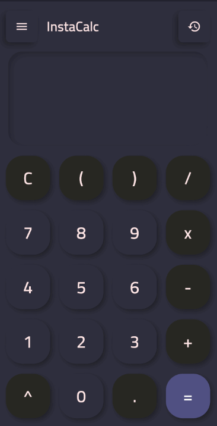

# InstaCalc

## About

InstaCalc is a calculator made with the Flutter framework.
Supports basic calculation.

## Platform support

Currently planned to support all platforms including Android, iOS, macOS, Windows and the web.

## Known bugs

1) The app does not scale well on bigger window sizes.

2) Scientific mode has a bug with arc(sin/cos/tan).

## Preview

### Home


### Drawer


### Settings


### Dark mode



## Installation
Download the required files from the **Releases** tab, install it in your device and run it.
**Only android supported currently.**

## Dev Installation

1) Install [Flutter](https://flutter.dev/docs/get-started/install) and necessary plugins for your editor.

2) Open your terminal and run the following:

```shell
$ git clone https://github.com/dhzdhd/InstaCalc.git
$ cd InstaCalc
$ flutter pub get
```

3) Run the app in your preferred device -

```shell
$ flutter run --release
```

## Contributing

I welcome any sort of contribution to make this app better.

1) Make an issue
2) Create a PR if you want to work on it
3) Create a new branch related to the issue

## Getting Started With Flutter

A few resources to get you started if this is your first Flutter project:

- [Lab: Write your first Flutter app](https://flutter.dev/docs/get-started/codelab)
- [Cookbook: Useful Flutter samples](https://flutter.dev/docs/cookbook)

For help getting started with Flutter, view the
[online documentation](https://flutter.dev/docs), which offers tutorials,
samples, guidance on mobile development, and a full API reference.
